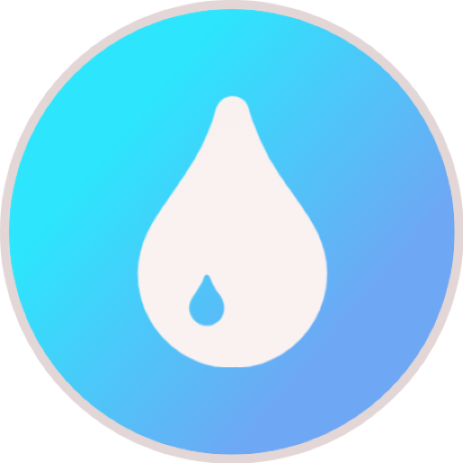

  
  <h1 align="center">Tem Água Pernambuco</h1>

Uma Skill para Alexa desenvolvida em Python para consultar o calendário de abastecimento e manutenções da **Compesa** de forma rápida e por voz.

Este projeto é **Open Source** e visa facilitar o acesso à informação para os moradores de Pernambuco, convertendo os dados técnicos do sistema da Compesa em respostas claras e naturais.

## Como usar

Após ativar a skill:

- _"Alexa, iniciar tem água pernambuco."_

Você pode dizer o nome do seu bairro, por exemplo:

- _"Prado."_
- _"Joana Bezerra."_
- _"Alto do Mandu."_

## Tecnologias

- **Python 3**: Lógica principal e extração de dados.
- **Alexa Skills Kit (ASK) SDK**: Integração com a voz.
- **REST API (Compesa)**: Fonte dos dados oficiais em tempo real.

## Bairros Suportados (Curadoria Manual)

Os bairros são mapeados manualmente para garantir que a Alexa entenda nomes comuns (Ex: "SANTO AMARO") em vez de nomes técnicos (Ex: "AREA 01 DISTRITO 20A").

> **Nota:** Se o seu bairro ainda não for reconhecido, você pode contribuir na seção abaixo.

### Atualmente mapeados:

- Alto da Bela Vista
- Alto da Conquista
- Alto da Manguba(Alto e Baixo)
- Alto da Sucupira
- Alto do Cajueiro
- Alto do Mandu
- Alto Santa Isabel
- Cabanga
- Caçote
- Caixa D'Água
- Centro(Recife)
- Coronel dos Passos
- Coqueiral
- Córrego do Abacaxi(Alto, Baixo e Entrada)
- Engenho do Meio
- Espinheiro
- Jaqueira
- Joana Bezerra
- Madalena
- Poço da Panela
- Prado
- Recife Antigo
- Rio Doce
- Roda de Fogo
- Rosarinho
- Santana
- Santo Amaro
- Santo Antônio
- São Benedito
- São José
- Sapucaia
- Tamarineira
- Torre
- 
- (Sinta-se à vontade para adicionar o seu aqui ao contribuir!)

## Como Contribuir

Se você quer adicionar um bairro ou corrigir um nome e ajudar no projeto, siga estes passos:

1. Faça um **Fork** do projeto.
2. Acesse o site oficial: Vá ao [Calendário de Abastecimento da Compesa](https://servicos.compesa.com.br/calendario-de-abastecimento-da-compesa/).
3. Identifique sua área: Selecione sua cidade e/ou bairro no site para descobrir o nome da sua área de calendário.
4. Abra o o arquivo `bairros_com_coordenada.json` para ver todos os IDs e nomes de área.
5. Use `Ctrl + F` para buscar pelo **nome da sua área** e encontrar o ID correspondente.
6. Adicione a entrada no arquivo `bairros.json` seguindo o padrão `"NOME DO BAIRRO": "ID"`.
7. Altere o `README.md` colocando o bairro novo
8. Envie um **Pull Request**.

> **Dica:** Caso queira adicionar um bairro que não conhece, use as coordenadas presentes no arquivo. Você pode verificar a localização no [Calendário](https://servicos.compesa.com.br/calendario-de-abastecimento-da-compesa/) ou no _Google Maps_ para verificar a área.

## Padronização de Commits

Para manter o projeto organizado, utilize os prefixos abaixo em suas mensagens de commit:

`data`: Para adição ou alteração de bairros e IDs nos arquivos JSON.

`feat`: Para novas funcionalidades no código da Skill.

`fix`: Para correção de bugs ou erros de digitação.

`docs`: Para melhorias no README ou documentação.

Exemplo: `data: adiciona bairro Santo Amaro com ID D20A`

## Licença

Este projeto é distribuído sob a licença MIT. Os dados de abastecimento são de propriedade e responsabilidade da Compesa.

---

_Desenvolvido por Rodrigofms_
